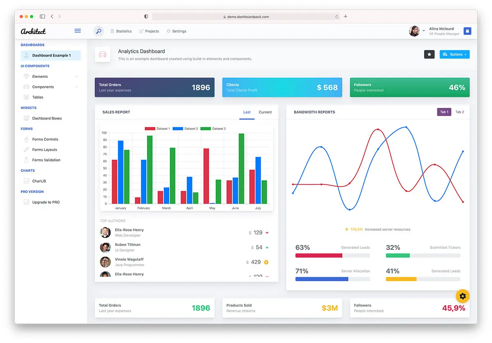

# ArchitectUI Bootstrap 5 jQuery/HTML Theme FREE
## Made with love by DashboardPack.com

[](https://github.com/DashboardPack/architectui-html-theme-free)
[](package.json)
[](package.json)
[](src/assets/)

ArchitectUI is a **Modern Clean Responsive HTML Bootstrap 5 Admin UI Dashboard Template**. It is used by thousands of developers to build SaaS and various other admin panels for web apps. This version hosted on Github is for preview only. It has a limited functionality in comparison to [Pro version](https://dashboardpack.com/theme-details/architectui-dashboard-html-pro/?utm_source=github&utm_medium=readme&utm_campaign=architectui-html-upgrade&utm_content=intro-link) yet it comes with unlimited color schemes and flexibility unmatched to most other Premium admin dashboards.

## What's New in v4.8.0

### **🔒 Security Patch (August 2026)**
- **PostCSS path traversal fixed** — [GHSA-r28c-9q8g-f849](https://github.com/advisories/GHSA-r28c-9q8g-f849) (High). PostCSS ≤ 8.5.17 could disclose arbitrary `.map` files via `sourceMappingURL` auto-loading; now on **8.5.25**
- **16 vulnerabilities → 0** — including 2 critical (`shell-quote`, `websocket-driver`) and 6 high
- **Security floors pinned** via `overrides` so fresh installs can't regress

### **🐛 Two Real Bugs Fixed**
- **Chart.js demos would have rendered blank canvases on webpack ≥ 5.109.0** — the bundler strips side-effect-only imports, dropping the `chartColors` palette. Now imported as a proper binding. (Bisected: 5.108.4 fine, 5.109.0 first bad — v4.7.0 shipped 5.107.2 and was **not** affected)
- **Dev server wouldn't start on webpack-dev-server 6** — `watchFiles` globs now pass an explicit `cwd` (WDS 6 forwards `cwd: undefined` into tinyglobby and throws)

### **📦 Dependency Refresh**
- **webpack-dev-server 6** major upgrade
- **Webpack 5.109**, **Sass 1.102**, **ESLint 10.8**, **FontAwesome 7.3.1**
- **Verified** — all 26 demo pages load in headless Chromium with zero console errors

> **Requires Node.js 22.15+** (webpack-dev-server 6 and sass-loader 17).

### **Previous Release: v4.7.0 (June 2026)**
- **Major bumps** - `@babel/core` 8, `@babel/preset-env` 8, `sass-loader` 17
- **Babel 8 ready** - `.babelrc` updated for the new major (removed the retired `bugfixes` flag)

### **Earlier Release: v4.6.0**
- **Full dependency refresh** - `copy-webpack-plugin` 14, `css-minimizer-webpack-plugin` 8, `eslint` 10, `webpack-cli` 7 (May 2026)

See [CHANGELOG.md](Changelog.md) for complete details.

## Earlier Release: v4.2.0

### 🚀 **Complete Modernization**
- **Latest Dependencies** - All npm packages updated to current versions
- **Future-Proof SASS** - Modern `@use` syntax, zero deprecation warnings
- **Enhanced Security** - Zero vulnerabilities detected
- **Modern Tooling** - ESLint v9, Webpack 5.99, latest build tools

### 🗺️ **Maps Component** (Updated in v4.4.0)
- **Real Google Maps** - Fully interactive maps with actual map data
- **Free to Use** - No API key required, uses Google's iframe embed system
- **5 Global Locations** - Tokyo, New York, London, Paris, San Francisco
- **Professional Quality** - All standard Google Maps features included

### 📦 **Performance Improvements**
- **Reduced Bundle Size** - 50KB improvement (1.87 MiB → 1.82 MiB)
- **Faster Builds** - Optimized webpack configuration
- **Clean Console** - No 404 errors or warnings during development
- **Better Caching** - Improved asset loading and browser caching

### 🔧 **Developer Experience**
- **Modern SASS** - Using latest `@use` modules instead of deprecated `@import`
- **ESLint v9** - Latest linting with flat configuration format
- **Clean Development** - Professional console output without noise
- **Security First** - All dependencies audited and updated

## PRO Version Available [here](https://dashboardpack.com/theme-details/architectui-dashboard-html-pro/?utm_source=github&utm_medium=readme&utm_campaign=architectui-html-upgrade&utm_content=pro-banner) 🏆

## Preview



## 🚀 Quick Start

### Installation
Download and Uncompress the theme package archive in your desired folder location.

Download and install Node.js LTS from https://nodejs.org/en/download/

Install the app dependencies by running the following command in the command line inside the folder root where you have unzipped the theme package archive.

```bash
npm install
```

After npm finishes installing the modules from package.json you can go ahead and start the application. To do so, run the command below.

```bash
npm run start
```

After the command finished, you should see a **Compiled successfully!** message in your terminal window. Also, a web server service will be started so you can view your app in the browser: **http://localhost:8080**

### Production Build
To create a production optimized build run the command below:

```bash
npm run build
```

This created another folder in the root of your project named build. You'll have an option to start a local web server to view your newly created production build.

## 🎯 **Key Features**

### **Modern Technology Stack**
- **Bootstrap 5.3.8** - Latest version with all features
- **jQuery 4.0.0** - Major modernization release
- **Chart.js 4.5.1** - Beautiful data visualizations
- **FontAwesome 7.3.1** - Latest icon library version
- **SASS 1.102.0** - Modern CSS preprocessing
- **Webpack 5.109.2** - Latest build tooling

### **Components & Features**
- ✅ **Responsive Design** - Mobile-first approach
- ✅ **Real Google Maps** - 5 interactive locations, no API keys required
- ✅ **Chart Integration** - Beautiful data visualization with Chart.js
- ✅ **Calendar Component** - Full-featured event management
- ✅ **Form Elements** - Complete form components library
- ✅ **Navigation Systems** - Multiple menu styles
- ✅ **Card Components** - Flexible content containers
- ✅ **Button Variants** - Extensive button library
- ✅ **Icon Libraries** - FontAwesome 7, PE7, Linearicons
- ✅ **Animation Support** - Smooth transitions and effects

### **Developer Benefits**
- 🔒 **Security Focused** - Zero vulnerabilities
- 🚀 **Performance Optimized** - Fast loading times
- 🛠️ **Easy Customization** - Well-structured SASS files
- 📱 **Mobile Ready** - Responsive across all devices
- 🎨 **Theme Flexibility** - Multiple color schemes
- 🔧 **Modern Tooling** - Latest development tools

## 📁 **Project Structure**
```
architectui-html-theme-free/
├── src/
│   ├── assets/           # SASS, images, fonts
│   ├── DemoPages/        # HTML templates
│   ├── layout/           # Layout components
│   └── scripts-init/     # JavaScript modules
├── build/                # Production build output
├── package.json          # Dependencies and scripts
└── webpack.config.js     # Build configuration
```

## 🔄 **Upgrade from v4.1.0**
This version includes breaking improvements. For existing projects:

1. **Backup your customizations**
2. **Update dependencies**: `npm install`
3. **Review SASS changes** if you've customized themes
4. **Test your maps** - new implementation may require updates

## **Version History**
- **v4.8.0** (2026-08-03) - PostCSS security patch, webpack-dev-server 6, chart + dev-server bug fixes
- **v4.7.0** (2026-06-19) - Full dependency refresh, Babel 8 + sass-loader 17, latest webpack/eslint/sass toolchain
- **v4.6.0** (2026-05-13) - Full dependency refresh, latest webpack/eslint/sass toolchain
- **v4.5.0** (2026-01-29) - jQuery 4.0 upgrade, all dependencies updated
- **v4.4.0** (2025-11-17) - Real Google Maps integration, improved UX
- **v4.3.0** (2025-09-17) - FontAwesome 7 upgrade, complete dependency refresh
- **v4.2.0** (2025-06-20) - Complete modernization, SASS future-proofing
- **v4.0.0** (2023-10-17) - React v18 migration, dependency upgrades
- **v3.1.0** (2022-08-22) - Library updates
- **v3.0.0** (2022-04-05) - WebPack v5 migration
- **v2.0.0** (2021-09-07) - Bootstrap v5 migration

## 🤝 **Contributing**
We welcome contributions! Please feel free to submit issues and pull requests.

## 📄 **License**
Licensed under MIT. See [LICENSE](LICENSE) for details.

## 🔗 **Links**
- **Website**: [DashboardPack.com](https://dashboardpack.com)
- **Pro Version**: [ArchitectUI Pro](https://dashboardpack.com/theme-details/architectui-dashboard-html-pro/?utm_source=github&utm_medium=readme&utm_campaign=architectui-html-upgrade&utm_content=footer-link)
- **Documentation**: Available with Pro version
- **Support**: [Contact Support](https://dashboardpack.com/contact)

